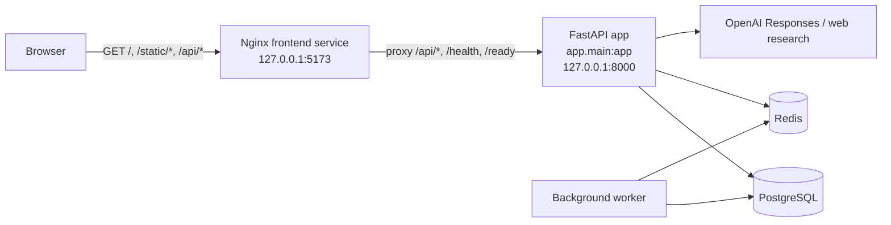

# Architecture

Purpose: verified current-system architecture and the boundary between current and target designs.
Information owner: repository maintainers.
Read when: working on backend, frontend, deployment, or integration tasks.
Update when: the serving stack, data flow, auth model, or deployment topology changes.
Last verified date: 2026-07-22 (operating-mode/capability layer added; the serving-topology facts in this file predate that pass but remain accurate — see `docs/context/CURRENT_STATE.md` and `docs/architecture/OPERATING-MODES-ARCHITECTURE-BRIDGE.md` for the fuller current inventory).
Relevant sources: `docker-compose.yml`, `ops/nginx/default.conf`, `app/main.py`, `app/auth.py`, `app/capability_store.py`, `app/capability_gate.py`, `app/mode_transition_store.py`, `app/orchestrator.py`, `app/services/openai_web.py`, `app/services/optimus_chat.py`, `app/db.py`, `app/db_models.py`, `alembic/versions/035_operating_mode_confirmed_at.py`.

## Current Architecture

- Browser loads the static frontend from Nginx at `http://127.0.0.1:5173`.
- The frontend calls relative `/api/...` paths, so browser requests stay same-origin through the Nginx proxy.
- Nginx serves `app/static/` and proxies `/api/`, `/health`, and `/ready` to FastAPI.
- FastAPI provides auth, health, readiness, context, customer, vehicle, estimate, estimate-approval, work-order, invoice, chat, and location endpoints.
- PostgreSQL stores users and sessions.
- Redis backs the application worker path in `docker-compose.yml`.
- The background worker runs as `python -m scripts.optimus_worker`.
- OpenAI requests remain server-side in the chat and research services.
- Alembic manages schema evolution for the PostgreSQL database. The current migration head is `035_operating_mode_confirmed_at`.
- Operating mode (Solo / Mobile Field / Shop) is a per-shop workflow-shape axis, separate from subscription tier. A single capability-resolution service (`app/capability_store.py`) resolves `(operating_mode, tier, role)` to a capability snapshot exposed at `GET /api/capabilities`; the capability gate (`app/capability_gate.py`) runs the Bays capability in OBSERVE mode only (telemetry, no enforcement — an AST safeguard blocks any route from referencing `CapabilityGateMode.ENFORCE`). Owners set their mode through the transition service (`app/mode_transition_store.py`) via owner/manager settings-based operating-mode management and an owner-only, non-blocking post-signup onboarding step (`Shop.operating_mode`, `Shop.operating_mode_confirmed_at`). Frontend navigation is capability-shaped as an affordance over the capability service, never as the enforcement mechanism.

## Mermaid Diagram

## Current Boundaries

- Auth is cookie-backed and server-side.
- Browser code never receives server API keys.
- Same-origin `/api/` routing is the expected local-development path.
- The repository does not contain a separate React or Vite source tree.
- Customer, vehicle, estimate, estimate revision, estimate approval, work order, and invoice records are stored in PostgreSQL and exposed through owner-scoped FastAPI routes plus a customer-facing approval route that relies on hashed approval tokens.

## Target Architecture

- No approved architectural replacement exists at present.
- Customer and vehicle modules are now implemented on the current FastAPI plus PostgreSQL stack.
- Work orders and invoices are implemented on the current FastAPI plus PostgreSQL stack.
- Estimate approval persistence and API routes are implemented in the current FastAPI plus PostgreSQL stack, but the billable live browser proof remains intentionally deferred pending owner approval.
- Future changes must be recorded in `DECISIONS.md` before this file is rewritten to describe them as current.
